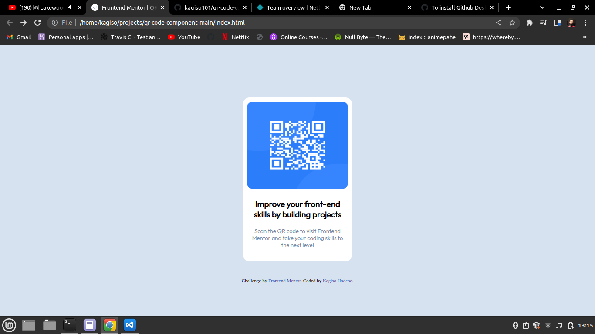

# Frontend Mentor - QR code component solution

This is a solution to the [QR code component challenge on Frontend Mentor](https://www.frontendmentor.io/challenges/qr-code-component-iux_sIO_H). Frontend Mentor challenges help you improve your coding skills by building realistic projects. 

## Table of contents

- [Overview](#overview)
  - [Screenshot](#screenshot)
  - [Links](#links)
- [Author](#author)

### Screenshot

### Links

- Solution URL: https://github.com/kagiso101/qr-code-component-main
- Live Site URL: https://kagiso101.github.io/qr-code-component-main/

## My process

### Built with

- HTML5 markup
- CSS custom properties
- Flexbox
- CSS Grid
- Mobile-first workflow

## Author

- Frontend Mentor - [@Kagiso101](https://www.frontendmentor.io/profile/kagiso101)
- Instagram - [@kagiso.ha](https://www.instagram.com/kagiso.ha/)
